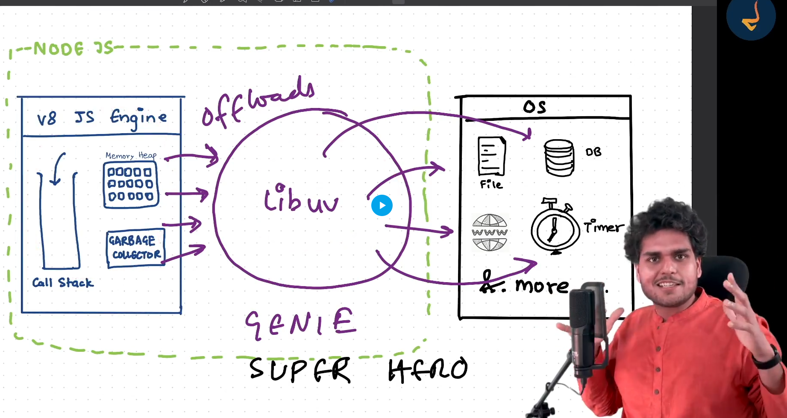

# 🙏 Namaste Node.js

## Node.js (By Shivam Gupta)

> "Where there is JavaScript, there is a JavaScript engine."

---

### 📚 Guided by: [Akshay Saini](https://www.linkedin.com/in/akshaymarch7/)  **(Founder of Namaste Dev)**
Big thanks to **Akshay Saini** for creating insightful content that’s helping me and many others understand Node.js in a simple and structured way. 🙌

### 👨‍💻 Author: [Shivam Gupta](https://www.linkedin.com/in/shivam-gupta-92a129175/)  
Sharing what I learn to help others and reinforce my understanding.

---
## Lesson-1 : Intorduction to Node.js (By Shivam Gupta)

### 📌 What is Node.js?

Node.js is a **JavaScript runtime** built on **Chrome's V8 engine**.  
It allows JavaScript to run **outside the browser**, such as on:

- Servers  
- IoT devices  
- Smartwatches  
- And more

---

### 📖 History of Node.js

- Created in **2009** by **Ryan Dahl**, initially using **Mozilla's SpiderMonkey** engine.
- After 2 days, he switched to **Google’s V8 engine** and never looked back.
- Originally named **Web.js**, but later renamed to **Node.js** by Ryan.

#### ❓ Why Node.js was created:

- Traditional servers like **Apache HTTP Server** had **blocking I/O**.
- Node.js introduced **non-blocking I/O**, making it more efficient for handling multiple requests.

#### 🚀 Milestones:

- Sponsored by **Joyent** (where Ryan worked), which helped Node.js grow.
- **2010**: **NPM (Node Package Manager)** was created by **Isaac Z. Schlueter**.
- Initially supported only **Linux and macOS**.
- **2011**: **Microsoft and Joyent** added **Windows support**, making Node.js cross-platform.
- **2012**: Ryan left the project; Joyent took over.
- **2014**: A fork named **IO.js** was created.
- **2015**: Node.js and IO.js merged again.
- **2019–Present**: Maintained by the **OpenJS Foundation**, after the Node.js Foundation merged with the JS Foundation.

---

#### 🗂️ Timeline (Node.js History Diagram)

```text
2009   ──────> Ryan Dahl creates Node.js (SpiderMonkey → V8)
2010   ──────> NPM introduced by Isaac
2011   ──────> Joyent + Microsoft add Windows support
2012   ──────> Ryan leaves, Joyent takes over
2014   ──────> Fork: IO.js
2015   ──────> Merge: Node.js + IO.js
2019   ──────> Node.js moves to OpenJS Foundation.
```
---


---

# Lesson 2: Node.js (JavaScript on the Server)

## 📌 Part 1 - How the Web Works

This section provides a basic overview of how the web functions — from entering a URL in your browser to seeing a webpage rendered.


---

### 🚀 Step-by-Step Process

#### 1. Entering a URL
You enter a web address like `https://www.example.com` into your browser.

---

#### 2. DNS Lookup
The browser contacts a **DNS (Domain Name System)** server to convert the domain (`example.com`) into an **IP address** (e.g., `192.0.2.1`), which identifies the server on the internet.

---

#### 3. Making an HTTP/HTTPS Request
Once the IP address is resolved, the browser sends a request using:
- **HTTP** (HyperText Transfer Protocol)
- **HTTPS** (Secure HTTP with encryption)

---

#### 4. Server Processes the Request
The **web server** (e.g., Apache, Nginx, Node.js) receives the request:
- Executes server-side logic (like querying a database)
- Fetches data or files
- Sends a response back to the browser

---

#### 5. HTTP Response
The server responds with:
- A **status code** (`200 OK`, `404 Not Found`, etc.)
- **Content** such as HTML, CSS, JS, JSON, or images

---

#### 6. Browser Renders the Page
The browser:
- Parses the HTML
- Loads CSS and JS files
- Executes JS
- Displays the webpage

---

#### 7. Interaction & Dynamic Updates
As users interact:
- JavaScript updates the UI dynamically (DOM manipulation)
- Data can be fetched asynchronously using **AJAX**, **Fetch API**, or **WebSockets**

---

### 📦 Technologies Involved

| Component      | Examples                                |
|----------------|------------------------------------------|
| Browser        | Chrome, Firefox, Safari                  |
| Protocols      | HTTP, HTTPS, DNS, TCP/IP                 |
| Web Server     | Apache, Nginx, Node.js, Express          |
| Frontend       | HTML, CSS, JavaScript                    |
| Backend        | PHP, Python, Java, Node.js               |
| APIs           | REST, GraphQL, WebSockets                |

---

> ✨ Understanding how the web works is foundational for becoming a great web developer.

---

## 📌 Part 2 - Server with Node.js

Thanks to Node.js, we can now use JavaScript on the server side too. This means a developer skilled in JavaScript can build full-stack applications using frontend and backend technologies — enabling stacks like **MERN** (MongoDB, Express, React, Node.js) with a single language.

---

### 🔍 How Node.js Works

- **Node.js** is a C++ application.
- It uses the **Chrome V8 JavaScript engine**, which is also written in C++.
- **V8** compiles JavaScript into **machine code** that your computer can execute.
- **ECMAScript** standards define the rules and syntax of JavaScript.
- All JavaScript engines (V8, SpiderMonkey, etc.) must follow ECMAScript standards to ensure consistency.


---

### 🌍 Node.js Ecosystem



**Node.js** = V8 Engine + libuv + Node APIs

/text

| Component       | Written In | Responsibility                               |
|------------------|------------|-----------------------------------------------|
| V8 Engine         | C++        | Compiles and executes JS                      |
| libuv            | C          | Handles I/O operations, event loop, threads   |
| Event Loop       | C/libuv    | Manages async operations                      |
| Thread Pool      | C/libuv    | Offloads blocking/heavy tasks                 |
| C++ Bindings     | C++        | Interface between JS and OS-level operations  |
| Node.js APIs     | JS/C++     | Modules like `fs`, `http`, etc.               |
| npm              | JavaScript | Manages packages and dependencies             |

The **V8 engine** ensures ECMAScript compliance, while Node.js extends it with capabilities like:
- File system access
- Networking (HTTP APIs)
- Database connectivity
- OS interactions

These extras are not part of standard JavaScript but are made possible by Node.js bindings and native modules.

---


#### ✅ Happpy Learning:

 - This content is part of my learning journey in Node.js. If you find any mistakes or want to suggest improvements, feel free to contribute. Let's learn and grow together!
