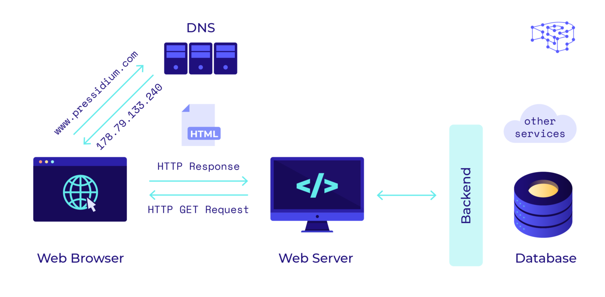

# 🙏 Namaste Node.js

## Node.js (By Shivam Gupta)

> "Where there is JavaScript, there is a JavaScript engine."

---

### 📚 Guided by: [Akshay Saini](https://www.linkedin.com/in/akshaymarch7/)  **(Founder of Namaste Dev)**
Big thanks to **Akshay Saini** for creating insightful content that’s helping me and many others understand Node.js in a simple and structured way. 🙌

### 👨‍💻 Author: [Shivam Gupta](https://www.linkedin.com/in/shivam-gupta-92a129175/)  
Sharing what I learn to help others and reinforce my understanding.

---
# Lesson-2 : Node.js (JS on server)

## 📌 Part 1  - How Web works

This document provides a basic overview of how the web functions, from the moment you enter a URL in your browser to the point where a webpage is rendered on your screen.

---

### 🚀 Step-by-Step Process

#### 1. Entering a URL
You enter a web address like `https://www.example.com` into your browser.

---

#### 2. DNS Lookup
The browser asks a **DNS (Domain Name System)** server to convert the human-readable domain (`example.com`) into an **IP address** (e.g., `192.0.2.1`), which locates the server on the internet.

---

#### 3. Making an HTTP/HTTPS Request
Once the IP address is known, the browser sends a request using either:
- **HTTP** (HyperText Transfer Protocol)
- **HTTPS** (Secure HTTP with encryption)

This request asks the web server to send the contents of the requested page.

---

#### 4. Server Processes the Request
The **web server** (e.g., Apache, Nginx, or a cloud platform):
- Receives the request
- Executes server-side logic if needed (e.g., PHP, Node.js)
- Retrieves data or files
- Sends a response back to the browser

---

#### 5. HTTP Response
The server responds with:
- **Status Code** (e.g., `200 OK`, `404 Not Found`)
- **Content** (HTML, CSS, JavaScript, images, or JSON data)

---

#### 6. Browser Renders the Page
The browser:
- Parses the HTML
- Loads styles from CSS files
- Executes JavaScript
- Displays content visually on your screen

---

#### 7. Interaction and Dynamic Updates
As you interact:
- JavaScript can update content dynamically (using DOM manipulation)
- Data can be fetched in real-time via **AJAX**, **Fetch API**, or **WebSockets**

---

#### 📦 Technologies Involved

| Component      | Technology Examples                        |
|----------------|--------------------------------------------|
| Browser        | Chrome, Firefox, Safari                    |
| Protocols      | HTTP, HTTPS, DNS, TCP/IP                   |
| Web Server     | Apache, Nginx, Node.js, Express            |
| Frontend       | HTML, CSS, JavaScript                      |
| Backend        | PHP, Python, Java, Node.js                 |
| APIs           | REST, GraphQL, WebSockets                  |

---

### 📘 Additional Resources

- [MDN Web Docs](https://developer.mozilla.org/en-US/docs/Learn/Getting_started_with_the_web)
- [How DNS Works](https://www.cloudflare.com/learning/dns/what-is-dns/)
- [How Browsers Work](https://www.html5rocks.com/en/tutorials/internals/howbrowserswork/)

---

> ✨ Understanding how the web works is the foundation for becoming a great web developer!

---

## Part 2 -  📌 Server with Node.js

- [Node Js Ecosysystem](./images/node-js-ecosystem.png)
In starting Javascript was used in Client side 
After node.js come we can use it on server side too.
Now a developer who know Javascript properly can build full stack application with frontend and backend which leverage to full stack development with stack like (MERN) with single developer.

Node.js   = v8 + super powers (like)

Majority of Node.js is written in C++ and Javascript
V8 engine is written in C++ and execute js code
Majority of code is written in C++ code
-C++   --> 72%
-javascript --> 26%
-python -1%
typescript ->0.3%
c-> 0.3%
others -- remaining

---

#### ✅ Happpy Learning:

 - This content is part of my learning journey in Node.js. If you find any mistakes or want to suggest improvements, feel free to contribute. Let's learn and grow together!
